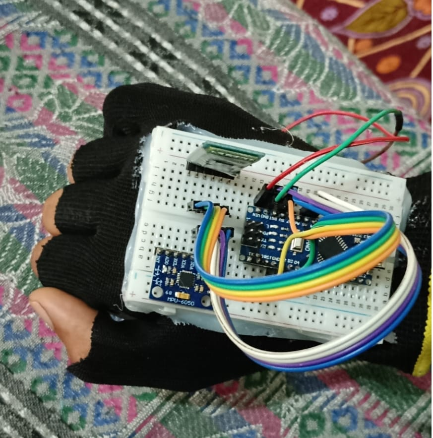
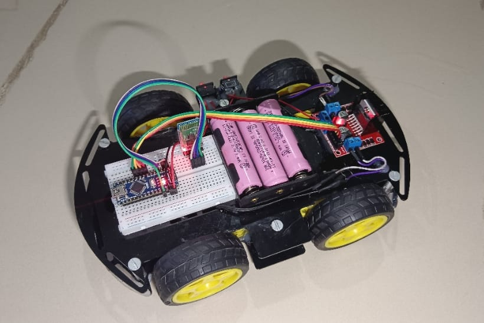
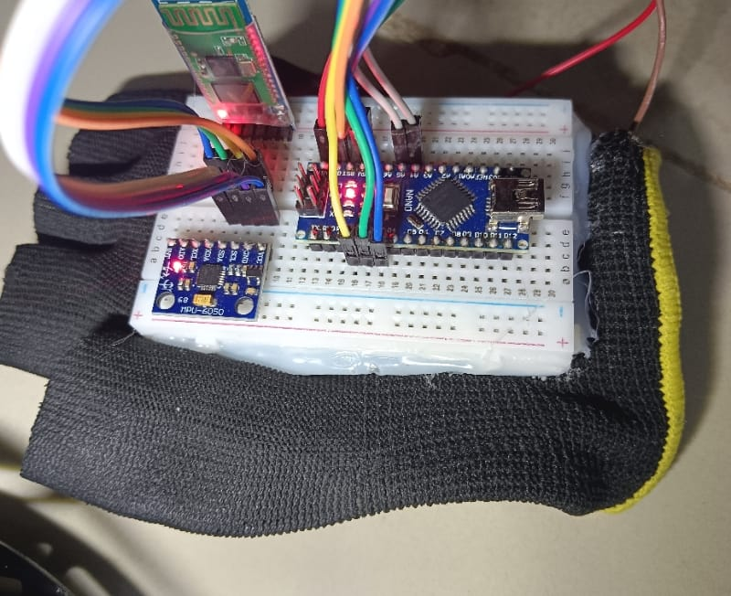
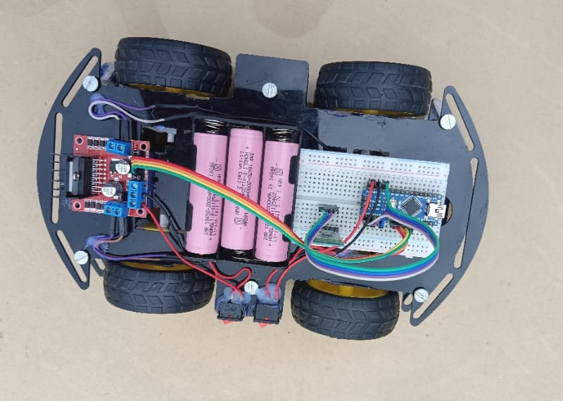

# Gesture-Controlled-Car
# Gesture Controlled Car

## Introduction
This project is an Arduino-based Gesture Controlled Car. It uses an MPU6050 accelerometer sensor to detect hand gestures and sends commands wirelessly through Bluetooth to control the movement of the car.

## Components Used
- Arduino Nano
- MPU6050 Sensor
- Bluetooth Module HC-05
- Motor Driver Module
- DC Motors
- Wheels
- Battery
- Connecting Wires
- Chassis

## Working Principle
The MPU6050 sensor detects the tilt movement of the hand. The transmitter Arduino reads the sensor values and sends commands through Bluetooth. The receiver Arduino receives these commands and controls the motors of the car.

## Control Commands
- F: Forward
- B: Backward
- L: Left
- R: Right
- S: Stop

## Features
- Wireless gesture-based control
- Bluetooth communication
- Real-time motion response
- Simple and low-cost robotics project

## Applications
- Robotics learning
- Wireless control systems
- Embedded system projects
- Assistive technology concepts

## Project Status
Completed
## Project Images

